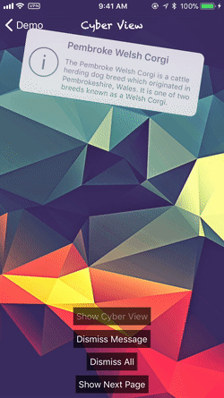
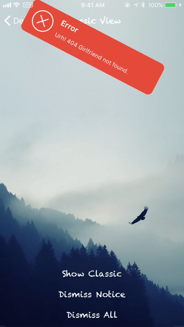
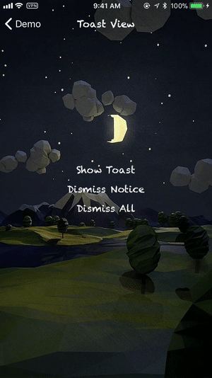
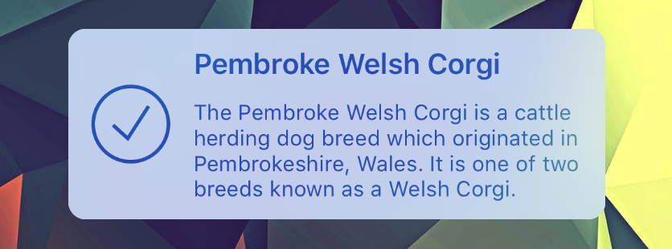
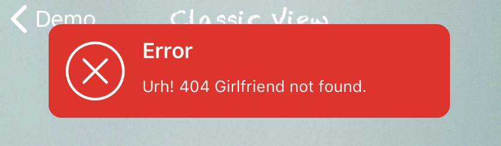

CFNotify
===============
[](https://travis-ci.org/hallelujahbaby/CFNotify)
[](https://github.com/hallelujahbaby/CFNotify/issues)
[](https://developer.apple.com/swift/)
[](https://github.com/hallelujahbaby/CFNotify/network)
[](https://github.com/hallelujahbaby/CFNotify/stargazers)
[](https://github.com/hallelujahbaby/CFNotify/blob/master/LICENSE)
[](https://github.com/Carthage/Carthage)
[](https://cocoapods.org/pods/CFNotify)

**CFNotify** is written in Swift. Using [`UIKit Dynamics`][UIKit Dynamics] as animator. It can make **ANY** `UIView` object _**draggable**_ and _**throwable**_. This library mainly use for _in-app notification_ and _alerts_. Let's notice and alert your users in more playable and fun way !





Features
-----------------
- [x] Work with **ANY** `UIView` object !
- [x] Using UIKit Dynamics. Light and Smooth !
- [x] Highly Customizable
- [x] Included **three** ready to use views: `CyberView`, `ClassicView`, `ToastView`
- [x] Simple to implement

Requirements
-----------------
* Swift 4.0+
* Xcode 9
* iOS 9.0+

Change Log
------------------
Please read [CHANGELOG.md](CHANGELOG.md).

Installation
------------------
* #### [Carthage](https://github.com/Carthage/Carthage) (_Recommended_)
  Add the following lines into  [Cartfile][Cartfile]  

  ````bash
  #CFNotify
  github "hallelujahbaby/CFNotify"
  ````

  Run `carthage update` and then add **CFNotify.framework** and **CFResources.bundle** into your project

* #### [Cocoapods](https://cocoapods.org/)
  Add the following lines into [Podfile][Podfile]

  ````ruby
  pod "CFNotify"
  ````

Getting Started
-----------------
There is an **example project** inside the [source code](https://github.com/hallelujahbaby/CFNotify/archive/master.zip). You are suggested to have a look first and get familiar with this framework.

### The Basics
This is the basic function with all **default** settings, design your own `UIView` or use [`CFNotifyView`](#cfnotifyview) to create one easily.
````swift
CFNotify.present(view: UIView)
````
If you need more **custom** settings, create your own [`Config`](#config) and use the following function.
````swift
CFNotify.present(config: Config, view: UIView)
````
if you want **custom** `tap` action, use the following function. (If you use tapHandler, it will override the default tap to hide action)
````swift
CFNotify.present(config: Config, view: UIView, tapHandler: (()->Void)?)
````

`CFNotify` will put all the views to be shown in queue (**First In First Out**).
You can hide the view programmatically using the following functions.
````swift
CFNotify.hide() // hide the current view

CFNotify.hideAll() // hide all the views in queue (Clear the queue)
````

### CFNotifyView
You can create an alert view quickly and easily by using `CFNotifyView` class.  

`CFNotifyView` included **3** ***views*** currently: [`Cyber`](#cyber), [`Classic`](#classic), [`Toast`](#Toast).

Each style has **4** ***themes***: `Info`, `Success`, `Fail`, `Warning`

Each theme has **2** ***styles***: `Light` and `Dark`
* #### Cyber
  
  ````swift
  let cyberView = CFNotifyView.cyberWith(title: "Title",
                                          body: "Body",
                                         theme: .Info(.Light))

  //More customizations
  let customCyberView = CFNotifyView.cyberWith(titleFont: UIFont,
                                              titleColor: UIColor,
                                                bodyFont: UIFont,
                                               bodyColor: UIColor,
                                         backgroundColor: UIColor,
                                               blurStyle: UIBlurEffectStyle)
  ````
* #### Classic
  
  ````swift
  let classicView = CFNotifyView.classicWith(title: "Title",
                                              body: "Body",
                                             theme: .Success(.Light))

  //More customizations
  let customClassicView = CFNotifyView.classicWith(titleFont: UIFont,
                                                  titleColor: UIColor,
                                                    bodyFont: UIFont,
                                                   bodyColor: UIColor,
                                             backgroundColor: UIColor)
  ````
* #### Toast
  
  ````swift
  let toastView = CFNotifyView.toastWith(text: "Text",
                                        theme: .Fail(.Dark))

  //More customizations
  let customToastView = CFNotifyView.toastWith(text: String,
                                           textFont: UIFont,
                                          textColor: UIColor,
                                    backgroundColor: UIColor)                                    
  ````

### Config
You can config `CFNotify` using `Config` class. `Config` class included lots of properties, the following three are the most common:
* `initPosition` : where the view is born
* `appearPosition` : where the view appear position
* `hideTime` : the view will automatically hide after `hideTime` (default is 3 sec)

Example:
````swift
var classicViewConfig = CFNotify.Config()
classicViewConfig.initPosition = .top(.random) //the view is born at the top randomly out of the boundary of screen
classicViewConfig.appearPosition = .top //the view will appear at the top of screen
classicViewConfig.hideTime = .never //the view will never automatically hide
````

### Delegate
`CFNotify` provides **Delegate** methods for some of common events.
You need to conform to the `CFNotifyDelegate`.
````swift
func cfNotifyDidAppear() {}

func cfNotifyStartDragging(atPoint: CGPoint) {}

func cfNotifyIsDragging(atPoint: CGPoint) {}

func cfNotifyEndDragging(atPoint: CGPoint) {}

func cfNotifyDidDisappear() {}

func cfNotifyIsTapped() {}
````


To-Do List
------------------
- [ ] Add [**SPM**][SPM] support
- [ ] Improve the example app
- [ ] Add alert view with buttons
- [ ] Full documentation

Bugs and issues
-----------------
If you find any bugs or encounter some issues regard to this framework, please feel free to open a new issue in [Issues](https://github.com/hallelujahbaby/CFNotify/issues) page.

Contribute
------------------
You are welcome to contribute into this project, feel free to [Pull Request](https://github.com/hallelujahbaby/CFNotify/pulls).

License
------------------
***CFNotify*** is released under an [MIT License][MIT]. See [LICENSE](LICENSE) for details.

[UIKit Dynamics]:https://developer.apple.com/documentation/uikit/animation_and_haptics/uikit_dynamics
[Cartfile]:https://github.com/Carthage/Carthage/blob/master/Documentation/Artifacts.md#cartfile
[Podfile]:https://guides.cocoapods.org/syntax/podfile.html
[SPM]:https://github.com/apple/swift-package-manager
[MIT]:http://opensource.org/licenses/MIT
